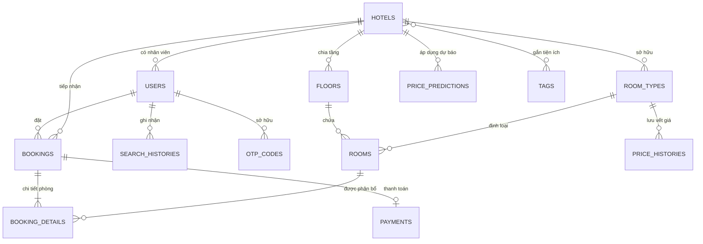

# HotelBookingApp
> **Dự án:** HotelBookingApp (Thương hiệu: **StayNow**)  
> **Ngôn ngữ & Nền tảng:** Python 3.10+ / Flask / MySQL
> **Kiến trúc:** Layered Architecture (Routes - Services - Models) kết hợp Application Factory Pattern & Event-Driven Realtime

---

## MỤC LỤC TỔNG QUAN

1. [ĐẶC TẢ YÊU CẦU PHẦN MỀM (SRS - SOFTWARE REQUIREMENTS SPECIFICATION)](#1-đặc-tả-yêu-cầu-phần-mềm-srs)
   - [1.1. Mục đích và Phạm vi Hệ thống](#11-mục-đích-và-phạm-vi-hệ-thống)
   - [1.2. Phân Hệ Người Dùng & Ma Trận Phân Quyền (Actors & Permissions)](#12-phân-hệ-người-dùng--ma-trận-phân-quyền)
   - [1.3. Yêu Cầu Chức Năng (Functional Requirements - FR)](#13-yêu-cầu-chức-năng-functional-requirements)
   - [1.4. Yêu Cầu Phi Chức Năng (Non-Functional Requirements - NFR)](#14-yêu-cầu-phi-chức-năng-non-functional-requirements)
2. [HƯỚNG DẪN CÀI ĐẶT & THIẾT LẬP (INSTALLATION GUIDE)](#2-hướng-dẫn-cài-đặt--thiết-lập-installation-guide)
   - [2.1. Yêu Cầu Môi Trường (Prerequisites)](#21-yêu-cầu-môi-trường-prerequisites)
   - [2.2. Các Bước Thiết Lập Chi Tiết Từng Bước](#22-các-bước-thiết-lập-chi-tiết-từng-bước)
   - [2.3. Bảng Tài Khoản Mặc Định Thử Nghiệm (Seed Accounts)](#23-bảng-tài-khoản-mặc-định-thử-nghiệm)
   - [2.4. Hướng Dẫn Chạy Kiểm Thử (Testing Guide)](#24-hướng-dẫn-chạy-kiểm-thử-testing-guide)
3. [TÀI LIỆU KỸ THUẬT (TECHNICAL DOCUMENTATION)](#3-tài-liệu-kỹ-thuật-technical-documentation)
   - [3.1. Kiến Trúc Cây Thư Mục Toàn Hệ Thống](#31-kiến-trúc-cây-thư-mục-toàn-hệ-thống)
   - [3.2. Mô Hình Kiến Trúc Phần Mềm (Software Architecture)](#32-mô-hình-kiến-trúc-phần-mềm)
   - [3.3. Thiết Kế Cơ Sở Dữ Liệu & ORM Models](#33-thiết-kế-cơ-sở-dữ-liệu--orm-models)
   - [3.4. Mô Tả Chi Tiết Các Tầng Mã Nguồn (Codebase Architecture)](#34-mô-tả-chi-tiết-các-tầng-mã-nguồn)
   - [3.5. Danh Mục Đặc Tả API (API Specifications)](#35-danh-mục-đặc-tả-api)
   - [3.6. Cơ Chế Tích Hợp Dịch Vụ Ngoài (Third-Party Integrations)](#36-cơ-chế-tích-hợp-dịch-vụ-ngoài)
   - [3.7. Hướng Dẫn Vận Hành & Bảo Trì Hệ Thống (Maintenance Guide)](#37-hướng-dẫn-vận-hành--bảo-trì-hệ-thống)
4. [SỔ TAY HƯỚNG DẪN SỬ DỤNG (USER MANUAL)](#4-sổ-tay-hướng-dẫn-sử-dụng-user-manual)
   - [4.1. Dành Cho Khách Hàng (Customer Guide)](#41-dành-cho-khách-hàng-customer-guide)
   - [4.2. Dành Cho Nhân Viên Lễ Tân (Receptionist Guide)](#42-dành-cho-nhân-viên-lễ-tân-receptionist-guide)
   - [4.3. Dành Cho Quản Trị Viên (Administrator Guide)](#43-dành-cho-quản-trị-viên-administrator-guide)

---

# 1. ĐẶC TẢ YÊU CẦU PHẦN MỀM (SRS)

## 1.1. Mục đích và Phạm vi Hệ thống
**StayNow (HotelBookingApp)** là giải pháp chuyển đổi số toàn diện cho chuỗi khách sạn và resort, giải quyết trọn vẹn vòng đời đặt phòng từ bước tìm kiếm thông minh, thanh toán tức thì đến khâu vận hành check-in/check-out tại quầy và tối ưu doanh thu thông qua trí tuệ nhân tạo.

### Mục tiêu cốt lõi:
- **Tối ưu trải nghiệm khách hàng:** Tìm kiếm khách sạn bằng ngôn ngữ tự nhiên (NLP), thanh toán quét mã MoMo phản hồi theo thời gian thực (real-time websocket), nhận diện gu sở thích để gợi ý khách sạn cá nhân hóa.
- **Hiện đại hóa nghiệp vụ quầy lễ tân:** Trực quan hóa tình trạng từng căn phòng theo ma trận tầng, xử lý check-in/out tức thời và tự động kết thúc phiên ở quá hạn.
- **Tối đa hóa doanh thu khách sạn (Revenue Management):** Ứng dụng mô hình AI dự báo công suất phòng (occupancy rate) và đề xuất điều chỉnh giá động theo biến động mùa vụ/cuối tuần.

---

## 1.2. Phân Hệ Người Dùng & Ma Trận Phân Quyền

Hệ thống phân cấp 4 nhóm tác nhân (Actors):

| Chức Năng / Phân Quyền | Khách Vãng Lai (Guest) | Khách Hàng (Customer) | Lễ Tân (Receptionist) | Quản Trị Viên (Admin) |
|:---|:---:|:---:|:---:|:---:|
| **Xem danh sách, chi tiết khách sạn** | ✅ | ✅ | ✅ | ✅ |
| **Tìm kiếm ngữ nghĩa bằng AI (NLP)** | ✅ | ✅ | ✅ | ✅ |
| **Nhận gợi ý khách sạn thông minh** | ✅ *(Xu hướng chung)* | ✅ *(Cá nhân hóa)* | ✅ | ✅ |
| **Xem & Lưu lịch sử tìm kiếm** | ✅ *(Theo Session/IP)* | ✅ *(Theo User ID)* | ✅ | ✅ *(Toàn quyền xóa)* |
| **Đăng ký, Đăng nhập, Quên mật khẩu** | ✅ | ✅ | ✅ | ✅ |
| **Xác thực Email qua mã OTP** | ❌ | ✅ | ✅ | ✅ |
| **Cập nhật Hồ sơ & Avatar Cloudinary** | ❌ | ✅ | ✅ | ✅ |
| **Đặt phòng & Thanh toán MoMo QR** | ❌ | ✅ | ❌ | ❌ |
| **Nhận Email hóa đơn đặt phòng** | ❌ | ✅ | ❌ | ❌ |
| **Quản lý đơn cá nhân & Hủy hoàn tiền** | ❌ | ✅ | ❌ | ❌ |
| **Sơ đồ ma trận phòng theo tầng** | ❌ | ❌ | ✅ *(Khách sạn mình)* | ✅ *(Toàn chuỗi)* |
| **Check-in / Check-out tại quầy** | ❌ | ❌ | ✅ | ✅ |
| **Tính phụ thu trả phòng muộn** | ❌ | ❌ | ✅ | ✅ |
| **Tự động xử lý phòng quá hạn** | ❌ | ❌ | ✅ | ✅ |
| **Xem & Phê duyệt Dự báo giá AI** | ❌ | ❌ | ❌ | ✅ |
| **Kích hoạt chạy lại AI dự báo giá** | ❌ | ❌ | ❌ | ✅ |
| **Bật/Tắt chế độ bảo trì hệ thống** | ❌ | ❌ | ❌ | ✅ |
| **Quản trị cấu hình động (SystemConfig)** | ❌ | ❌ | ❌ | ✅ |

---

## 1.3. Yêu Cầu Chức Năng (Functional Requirements)

### FR-01: Quản Lý Định Danh & Tài Khoản (Authentication & Profile)
- **FR-01.1 Đăng ký tài khoản:** Cho phép đăng ký bằng `username`, `email`, `password`. Ràng buộc độ dài theo cấu hình động `MINIMUM_PASSWORD_LENGTH` (6) đến `MAXIMUM_PASSWORD_LENGHT` (20), chống ký tự đặc biệt/khoảng trắng. Mật khẩu được mã hóa an toàn.
- **FR-01.2 Đăng nhập & Duyệt phiên:** Hỗ trợ đăng nhập với ghi nhớ tài khoản bằng Flask-Login. Kiểm tra trạng thái kích hoạt tài khoản.
- **FR-01.3 Xác thực Email hai lớp (OTP Verification):** Sinh mã số ngẫu nhiên 6 chữ số (`000000` - `999999`), gửi qua giao thức SMTP Gmail trong mẫu HTML chuyên nghiệp. Thời hạn OTP điều khiển bởi tham số `OTP_EXPIRATION_MINUTES` (5 phút). Hệ thống chủ động vô hiệu hóa mã cũ và chống tấn công Replay Attack.
- **FR-01.4 Hồ sơ cá nhân & Tải ảnh đại diện:** Cho phép sửa số điện thoại (10 chữ số), cập nhật email (buộc xác minh lại OTP). Tải ảnh đại diện trực tiếp lên CDN **Cloudinary** lưu trữ an toàn.

### FR-02: Tìm Kiếm Ngữ Nghĩa AI & Bộ Lọc Nâng Cao (Semantic Search & Filters)
- **FR-02.1 Tìm kiếm ngôn ngữ tự nhiên (Semantic AI Search):** Tích hợp mô hình **Gemini 3.5 Flash** phân tích câu nhập liệu tự nhiên của người dùng (ví dụ: *"tìm khách sạn ở Vũng Tàu giá dưới 2 triệu có hồ bơi cho 4 người vào cuối tuần tới"*). AI tự động bóc tách thành đối tượng JSON chuẩn (`location`, `min_price`, `max_price`, `capacity`, `bed_count`, `check_in`, `check_out`, `tag_ids`, `sort_by`).
- **FR-02.2 Bộ lọc đa tiêu chí thuần SQL:** Lọc theo điểm đánh giá (Rating từ 1 đến 5 sao), khoảng giá niêm yết, danh mục tiện ích (Wifi, Bãi biển riêng, Hồ bơi, Spa, Gym...), số khách và số giường.
- **FR-02.3 Tự động lọc phòng trống (Availability Checking):** Truy vấn chéo với bảng `bookings` nhằm loại bỏ triệt để các phòng đã có người đặt trong khoảng ngày nhận/trả phòng.
- **FR-02.4 Ghi nhận vết tìm kiếm (Search Tracking):** Tự động lưu lịch sử tìm kiếm vào bảng `search_histories` theo User ID (nếu đã đăng nhập) hoặc UUID Session ID / IP Address (khách vãng lai), chống spam ghi log trong 30 giây.

### FR-03: Đề Xuất Khách Sạn Thông Minh (Recommendation Engine)
- **FR-03.1 Sơ loại ứng viên bằng SQL (Candidate Retrieval):** Trích xuất sở thích về địa điểm và tiện ích từ các tìm kiếm gần nhất kết hợp lịch sử các đơn đặt phòng thành công, sắp xếp theo điểm số trọng số kết hợp `Rating`.
- **FR-03.2 Chấm điểm tương thích bằng AI (LLM Reranking):** Truyền danh sách khách sạn tiềm năng cùng lịch sử hành vi vào Gemini API. AI phân tích ngữ cảnh, lựa chọn đúng 4 khách sạn tiêu biểu nhất và chấm điểm tương thích `match_score` (từ 60% đến 100%).
- **FR-03.3 Bộ nhớ đệm phân tầng (Tiered Caching):** Sử dụng `Flask-Caching` lưu kết quả gợi ý theo từng người dùng (TTL = 1 giờ) và khách vãng lai (TTL = 3 giờ) nhằm tối ưu chi phí gọi API và thời gian phản hồi.

### FR-04: Đặt Phòng Trực Tuyến & Thanh Toán MoMo Thời Gian Thực
- **FR-04.1 Kiểm tra ràng buộc đặt phòng:** Kiểm tra ngày nhận phòng không thuộc quá khứ, ngày trả phòng sau ngày nhận phòng, số phòng đặt trong một đơn không vượt quá `MAX_ROOMS_PER_BOOKING` (mặc định 5 phòng).
- **FR-04.2 Tính giá động linh hoạt (Dynamic Price Calculation):** Tự động áp dụng tỉ lệ tăng/giảm giá của các đề xuất AI đã được duyệt cho từng ngày lưu trú cụ thể, cộng thuế phí cấu hình `TAX_FEE_PERCENTAGE`.
- **FR-04.3 Tích hợp cổng thanh toán MoMo (Momo Capture Wallet):** Đóng gói dữ liệu đơn hàng dạng Base64 vào `extraData`, sinh chữ ký HMAC-SHA256, chuyển hướng đến trang thanh toán MoMo QR.
- **FR-04.4 Xử lý Webhook (MoMo IPN) & Đồng bộ thời gian thực:**
  - Xác thực chữ ký bí mật của MoMo gửi về server qua Webhook.
  - Phân bổ phòng trống thực tế vào bảng `booking_details`.
  - Phát tín hiệu **Socket.IO** (`payment_success`) tới trang thanh toán để trình duyệt của khách hàng tự động chuyển trang mà không cần F5.
  - Bắn sự kiện phát sóng (`booking_updated`) toàn hệ thống để cập nhật số lượng phòng khả dụng trên các phiên truy cập khác.
  - Tự động kích hoạt Thread gửi **Email xác nhận đơn phòng** kèm thông tin chi tiết.
- **FR-04.5 Cơ chế Tự động Hoàn tiền chống Đua lệnh (Anti Race-Condition Auto Refund):** Trong trường hợp xảy ra xung đột đặt phòng đồng thời (Overbooking) khiến việc tạo đơn phòng thất bại dù tiền đã bị trừ tại MoMo, hệ thống lập tức gọi API hoàn tiền (`refund_payment`) của MoMo, lưu log vào `refund_logs` và bắn Socket.IO thông báo cho khách.
- **FR-04.6 Hủy đơn & Hoàn tiền tự phục vụ:** Khách hàng được tự hủy đơn trong mục quản lý nếu thỏa mãn chính sách ngày hủy của khách sạn (`cancellation_policy_days`). Tiền được hoàn trả tự động qua MoMo API sau khi khấu trừ phí phạt `CANCELLATION_FEE_PERCENTAGE` (nếu có).

### FR-05: Quản Lý Quầy Lễ Tân & Sơ Đồ Phòng (Reception Desk Matrix)
- **FR-05.1 Ma trận phòng trực quan theo tầng:** Hiển thị toàn bộ sơ đồ phòng vật lý theo từng tầng với 4 trạng thái mã hóa màu:
  - 🟢 **AVAILABLE (Trống):** Sẵn sàng đón khách.
  - 🟡 **BOOKED (Đã đặt):** Có đơn đặt lịch trong ngày hôm nay.
  - 🔴 **OCCUPIED (Đang ở):** Khách đã nhận phòng thực tế tại quầy.
  - ⚪ **MAINTENANCE (Bảo trì):** Đang sửa chữa, tạm khóa nhận đặt.
- **FR-05.2 Tra cứu đơn đặt phòng nhanh:** Tìm kiếm đa năng theo mã đơn (ví dụ: `BK-12` hoặc `12`), họ tên khách hàng, số điện thoại hoặc lọc riêng các đơn có lịch đến trong ngày hôm nay.
- **FR-05.3 Quy trình Check-in tại quầy:** Ràng buộc chặt chẽ: đơn phải ở trạng thái `CONFIRMED`, đã thanh toán thành công 100%, đúng ngày nhận phòng và tất cả các phòng gán trong đơn phải chưa có khách ở.
- **FR-05.4 Quy trình Check-out & Phụ thu quá giờ:**
  - Kiểm tra giờ trả phòng so với giới hạn cấu hình `CHECK_OUT_TIME` (12:00 trưa).
  - Tự động tính phụ thu trễ giờ (10% tổng đơn tiền phòng).
  - Hoàn tất đơn sang `COMPLETED`, tự động giải phóng phòng về trạng thái `AVAILABLE`.
- **FR-05.5 Tự động kết thúc đơn quá hạn (Auto-checkout Engine):** Hệ thống định kỳ rà soát các đơn khách đã ở quá ngày hoặc quá 12:00 trưa ngày trả phòng mà chưa checkout tại quầy để chuyển trạng thái sang `COMPLETED` và mở lại phòng trống.

### FR-06: Dự Báo Giá Động & Quản Trị Doanh Thu (AI Revenue Management)
- **FR-06.1 Thu thập dữ liệu công suất phòng:** Định kỳ tính toán tỷ lệ lấp đầy (Occupancy Rate) trong chu kỳ `AI_PREDICTION_INTERVAL` (7 ngày tới) cho toàn bộ các khách sạn.
- **FR-06.2 Sinh khuyến nghị điều chỉnh giá qua AI:** Gửi dữ liệu công suất vào Gemini API, mô phỏng vai trò Giám đốc Doanh thu (Revenue Manager). AI phân tích xu hướng và sinh đề xuất:
  - Tăng giá (từ +10% đến mức trần `MAX_PRICE_ADJUSTMENT_PERCENTAGE`, mặc định +20%) khi công suất cao (>80%) hoặc rơi vào cuối tuần/ngày lễ.
  - Giảm giá (từ -5% đến -20%) khi công suất thấp (<30%) để kích cầu.
  - Kèm theo lý do giải trình ngắn gọn cho từng đề xuất.
- **FR-06.3 Bảng điều khiển quản trị giá cho Admin:** Quản trị viên duyệt từng đề xuất, bật/tắt áp dụng (`is_applied`). Giá sau khi duyệt sẽ ngay lập tức tác động vào thuật toán tính giá của hệ thống tìm kiếm và đặt phòng.
- **FR-06.4 Tác vụ tự động chạy ngầm (Cron Job):** Scheduler kích hoạt định kỳ vào đúng `00:00` hàng ngày để nạp dự báo giá mới.

### FR-07: Quản Trị Cấu Hình Hệ Thống Động (System Configuration)
- **FR-07.1 Không can thiệp mã nguồn:** Mọi tham số nghiệp vụ quan trọng đều lưu trong bảng `system_configs`.
- **FR-07.2 Cơ chế Cache Invalidation tức thì:** Sử dụng `@cache.memoize()` cho tốc độ đọc micro-giây, tự động xóa cache khi Admin cập nhật giá trị mới.
- **FR-07.3 Chế độ Bảo trì (Maintenance Mode):** Cho phép Admin kích hoạt `MAINTENANCE_MODE = true`. Khi đó toàn bộ người dùng thông thường và khách vãng lai sẽ nhận trang phản hồi `503 Service Unavailable`, trong khi Admin vẫn có quyền truy cập để khắc phục sự cố.

---

## 1.4. Yêu Cầu Phi Chức Năng (Non-Functional Requirements)

### NFR-01: Hiệu Năng & Khả Năng Mở Rộng (Performance & Scalability)
- Thời gian tải trang chủ và tìm kiếm cơ bản: `< 500ms`.
- Tốc độ phản hồi API tính toán giá động: `< 200ms`.
- Tích hợp **Flask-Caching** cho các phép toán nặng và truy vấn AI, giảm tải trên 80% lượt gọi trùng lặp.
- Sử dụng kết nối cơ sở dữ liệu dạng Connection Pooling qua SQLAlchemy.
- Hỗ trợ kiểm thử chịu tải bằng công cụ **Locust** mô phỏng đồng thời hàng trăm người dùng tra cứu phòng và tính toán đơn giá.

### NFR-02: Tính Toàn Vẹn & Nhất Quán Dữ Liệu (Data Integrity & Concurrency)
- Tuân thủ nghiêm ngặt nguyên lý ACID trong giao dịch cơ sở dữ liệu. Mọi thao tác ghi nhiều bảng (Booking + BookingDetail + Payment) đều chạy trong một Transaction và tự động rollback khi gặp sự cố.
- Cơ chế khóa lạc quan / kiểm tra xung đột phòng khả dụng ngăn chặn 100% tình trạng đặt trùng phòng (Overbooking).
- Script nạp dữ liệu `seed.py` được thiết kế chuẩn Idempotent: chạy nhiều lần không làm sai lệch hay nhân đôi dữ liệu.

### NFR-03: An Toàn & Bảo Mật (Security)
- **Chữ ký số MoMo:** Xác thực mã băm HMAC-SHA256 với khóa bí mật để đảm bảo dữ liệu Webhook IPN không bị giả mạo.
- **Phòng chống tấn công:**
  - Chống giả mạo Replay Attack mã OTP bằng cách tự động đánh dấu `is_used` và kiểm tra thời hạn sống.
  - Chống XSS bằng cơ chế tự động escape ký tự của Jinja2 và cookie `HttpOnly`.
  - Chống CSRF thông qua cookie `SameSite=Lax`.
  - Cấu hình giới hạn kích thước upload ảnh `MAX_CONTENT_LENGTH = 16MB`.
- **Quản lý khóa bí mật:** Toàn bộ API Key, DB Password, Secret Key tách biệt hoàn toàn trong file biến môi trường `.env`.

### NFR-04: Tính Sẵn Sàng & Độ Tin Cậy (Reliability & Resilience)
- Tự động bắt lỗi ngoại lệ HTTP (400, 401, 403, 404, 500, 503) và điều hướng về trang thông báo thân thiện.
- Gửi email chạy trong Background Thread độc lập, đảm bảo tiến trình đặt phòng không bị gián đoạn nếu máy chủ SMTP phản hồi chậm.

---

# 2. HƯỚNG DẪN CÀI ĐẶT & THIẾT LẬP (INSTALLATION GUIDE)

## 2.1. Yêu Cầu Môi Trường (Prerequisites)

Trước khi tiến hành cài đặt, hãy đảm bảo máy tính của bạn đã cài đặt các công cụ sau:
1. **Python 3.10 trở lên** (Khuyến nghị Python 3.10, 3.11 hoặc 3.12). Kiểm tra bằng lệnh:
   ```bash
   python --version
   ```
2. **Hệ quản trị CSDL MySQL 8.0+** (hoặc MariaDB / XAMPP MySQL). Kiểm tra bằng lệnh:
   ```bash
   mysql --version
   ```
3. **Trình duyệt Web hiện đại:** Google Chrome, Microsoft Edge hoặc Mozilla Firefox.
4. **Git CLI** (nếu cài đặt qua kho mã nguồn Git).

---

## 2.2. Các Bước Thiết Lập Chi Tiết Từng Bước

### Bước 1: Mở thư mục dự án
Mở cửa sổ dòng lệnh (PowerShell, Command Prompt hoặc Terminal) tại thư mục dự án:
```bash
cd d:\HotelBookingApp
```

### Bước 2: Tạo và kích hoạt Môi trường ảo (Virtual Environment)
*(Khi kích hoạt thành công, bạn sẽ nhìn thấy tiền tố `(venv)` ở đầu dòng lệnh).*

### Bước 3: Cài đặt toàn bộ thư viện phụ thuộc
Cài đặt tất cả các gói thư viện được khai báo trong `requirements.txt`:
```bash
pip install -r requirements.txt
```

### Bước 4: Tạo Cơ Sở Dữ Liệu MySQL
Mở MySQL Client hoặc công cụ giao diện (MySQL Workbench) tạo database rỗng có tên `hotel_db`.

### Bước 5: Cấu hình File Biến Môi Trường (`.env`)
Kiểm tra file `.env` tại thư mục gốc của dự án (nếu chưa có, tạo mới file tên `.env`). Cập nhật các thông số cho phù hợp với môi trường máy của bạn:

```ini
# Cấu hình Flask
FLASK_APP=run.py
FLASK_DEBUG=1
FLASK_ENV=development
SECRET_KEY=dev-secret-key-change-in-production

# Cấu hình Kết nối MySQL
DB_USER=root
DB_PASSWORD=your_mysql_password
DB_HOST=localhost
DB_PORT=3306
DB_NAME=hotel_db

# Cấu hình SocketIO & CORS
CORS_ALLOWED_ORIGINS=*

# Cấu hình Dịch vụ Gửi Email (Gmail SMTP)
MAIL_SERVER=smtp.gmail.com
MAIL_PORT=587
MAIL_USE_TLS=True
MAIL_USE_SSL=False
MAIL_USERNAME=your_email@gmail.com
MAIL_PASSWORD=your_app_password_16_characters
MAIL_DEFAULT_SENDER=your_email@gmail.com

# Cấu hình Lưu trữ Ảnh Avatar (Cloudinary)
CLOUDINARY_URL=cloudinary://<api_key>:<api_secret>@<cloud_name>

# Cấu hình Cổng Thanh Toán MoMo (Môi trường Test Sandbox)
MOMO_PARTNER_CODE=MOMO
MOMO_ACCESS_KEY=F8BBA842ECF85
MOMO_SECRET_KEY=K951B6PE1waDMi640xX08PD3vg6EkVlz
MOMO_ENDPOINT=https://test-payment.momo.vn/v2/gateway/api/create
MOMO_REFUND_ENDPOINT=https://test-payment.momo.vn/v2/gateway/api/refund

# Khóa API Trí Tuệ Nhân Tạo Google Gemini (Dành cho Semantic Search & Dynamic Pricing)
GEMINI_API_KEY=your_google_gemini_api_key
```

> [!NOTE]
> - Nếu bạn sử dụng mật khẩu tài khoản Gmail thông thường sẽ bị Google chặn. Cần vào tài khoản Google -> Bảo mật -> Tạo **Mật khẩu ứng dụng (App Password)** gồm 16 ký tự để điền vào `MAIL_PASSWORD`.
> - Để lấy `GEMINI_API_KEY` miễn phí, truy cập [Google AI Studio](https://aistudio.google.com/).

### Bước 6: Khởi tạo Cấu trúc Bảng & Nạp Dữ Liệu Mẫu (Seed Data)
Dự án tích hợp sẵn kịch bản nạp dữ liệu an toàn `seed.py`. Chạy lệnh sau:
```bash
python seed.py
````
*Quy trình nạp dữ liệu sẽ tự động nạp danh sách Tiện ích (Tags), Danh sách Khách sạn, Các Loại phòng, Các Tầng & Căn phòng cụ thể, Tài khoản người dùng mẫu, Tham số cấu hình hệ thống và Lịch sử tìm kiếm mẫu.*

### Bước 7: Khởi chạy Ứng dụng
Khởi động máy chủ:
```bash
python run.py
```
Khi khởi chạy thành công, terminal sẽ hiển thị thông báo:
```text
(xxxx) wsgi starting up on http://127.0.0.1:5000
```
Mở trình duyệt web bất kỳ và truy cập địa chỉ: **`http://127.0.0.1:5000`**

---

## 2.3. Bảng Tài Khoản Mặc Định Thử Nghiệm

Hệ thống đã nạp sẵn các tài khoản demo đầy đủ các quyền hạn:

| Tên Đăng Nhập (Username) | Mật Khẩu | Vai Trò (Role) | Khách Sạn Trực Thuộc | Ghi Chú |
|:---|:---:|:---:|:---|:---|
| **`admin`** | `123` | **ADMIN** | Toàn hệ thống | Quản trị viên cao nhất, duyệt giá AI, cấu hình hệ thống |
| **`letan_ks1`** | `123` | **RECEPTIONIST** | Wyndham Legend Halong | Nhân viên lễ tân quản lý sơ đồ phòng & check-in KS 1 |
| **`letan_ks2`** | `123` | **RECEPTIONIST** | FLC Grand Hotel Hạ Long | Nhân viên lễ tân quản lý sơ đồ phòng & check-in KS 2 |
| **`khachhang1`** | `123` | **CUSTOMER** | Không | Khách hàng mẫu (Đã xác minh email OTP) |
| **`khachhang2`** | `123` | **CUSTOMER** | Không | Khách hàng mẫu (Đã xác minh email OTP) |
| **`khachhang3`** | `123` | **CUSTOMER** | Không | Khách hàng mẫu (Chưa xác minh email OTP) |

---

## 2.4. Hướng Dẫn Chạy Kiểm Thử (Testing Guide)

Hệ thống cung cấp hệ thống kiểm thử toàn diện với **41 test suites**:

### 1. Kiểm thử Unit & Integration Tests (Services Layer):
Chạy kiểm thử toàn bộ logic nghiệp vụ (Booking, AI, MoMo, Checkout, OTP, User...):
```bash
pytest tests/services/
```

### 2. Kiểm thử Giao diện Người Dùng Tự Động (Selenium E2E):
Đảm bảo máy bạn đã cài trình duyệt Google Chrome:
```bash
# Chạy có hiển thị trình duyệt trực quan
pytest tests/selenium/

# Hoặc chạy chế độ ngầm không mở cửa sổ (Headless)
$env:SELENIUM_HEADLESS="1"; pytest tests/selenium/
```

### 3. Kiểm thử Chịu Tải & Hiệu Năng (Load Testing với Locust):
```bash
locust -f tests/locustfile.py --host=http://127.0.0.1:5000
```
Mở trình duyệt tại địa chỉ `http://localhost:8089`, cấu hình số lượng Virtual Users (ví dụ: 50 users, spawn rate: 5) để đo lường RPS (Requests Per Second) và độ trễ phản hồi.

---

# 3. TÀI LIỆU KỸ THUẬT (TECHNICAL DOCUMENTATION)

## 3.1. Kiến Trúc Cây Thư Mục Toàn Hệ Thống

```text
HotelBookingApp/
├── .env                                
├── .gitignore                         
├── config.py                          
├── requirements.txt                   
├── run.py                         # Điểm nhập cảnh khởi chạy ứng dụng (Entry-point)
├── seed.py                        # Kịch bản nạp và nâng cấp dữ liệu mẫu an toàn
├── seed_data/                     # Dữ liệu mẫu dạng bảng CSV
│   ├── floors_rooms.csv                # Dữ liệu phân bổ tầng và phòng
│   ├── hotels.csv                      # Dữ liệu danh sách khách sạn
│   ├── room_types.csv                  # Dữ liệu các hạng phòng
│   └── users.csv                       # Dữ liệu tài khoản người dùng ban đầu
├── app/                           # Mã nguồn chính của ứng dụng
│   ├── __init__.py                     # Application Factory (Hàm create_app)
│   ├── extensions.py                   # Khởi tạo các tiện ích rỗng (db, socketio, cache, mail...)
│   ├── models.py                       # 15 ORM Models & Enums ánh xạ CSDL MySQL
│   ├── events.py                       # Xử lý các sự kiện thời gian thực Socket.IO
│   ├── hooks.py                        # Middleware xử lý Request, Biến toàn cục & Chế độ bảo trì
│   ├── tasks.py                        # Tác vụ định kỳ chạy ngầm (APScheduler Jobs)
│   ├── utils.py                        # Các hàm tiện ích hỗ trợ (Múi giờ VN, chuyển đổi thời gian)
│   ├── routes/                    # TẦNG ĐỊNH TUYẾN (BLUEPRINTS - Đón nhận HTTP Request)
│   │   ├── __init__.py                 # Tổng hợp và nạp tự động danh sách Blueprints
│   │   ├── main.py                     # Route trang chủ và API trả về widget gợi ý
│   │   ├── auth.py                     # Route Đăng nhập, Đăng ký, Đăng xuất
│   │   ├── hotel.py                    # Route Danh sách khách sạn, Chi tiết, Tìm kiếm ngữ nghĩa
│   │   ├── booking.py                  # Route Tạo đơn phòng, Tính giá động, Webhook MoMo IPN
│   │   ├── profile.py                  # Route Trang cá nhân, Lịch sử đặt phòng, Hủy phòng hoàn tiền
│   │   ├── receptionist.py             # Route Phân hệ Lễ tân, Sơ đồ phòng, Check-in/Check-out
│   │   ├── admin.py                    # Route Phân hệ Quản trị, Duyệt giá AI Dynamic Pricing
│   │   └── search_history.py           # Route Xem, Xóa và Tìm lại theo Lịch sử tìm kiếm
│   ├── services/                  # TẦNG LOGIC NGHIỆP VỤ (SERVICE LAYER)
│   │   ├── __init__.py                 # Lớp BaseService dùng chung (Commit, Rollback, Pagination)
│   │   ├── ai_service.py               # Tích hợp Gemini 3.5 Flash (NLP Query, Reranking, Pricing)
│   │   ├── booking_service.py          # Nghiệp vụ đặt phòng, kiểm tra phòng trống, xử lý hoàn tiền
│   │   ├── checkout_service.py         # Nghiệp vụ Check-in/Check-out tại quầy, tự động giải phóng phòng
│   │   ├── email_service.py            # Xử lý gửi email xác thực OTP và hóa đơn bất đồng bộ
│   │   ├── hotel_service.py            # Nghiệp vụ truy vấn, lọc nâng cao và sắp xếp khách sạn
│   │   ├── momo_service.py             # Tích hợp API MoMo (Ký HMAC, tạo giao dịch, xác thực IPN, hoàn tiền)
│   │   ├── otp_service.py              # Sinh mã OTP, xác thực thời hạn và chống Replay Attack
│   │   ├── prediction_service.py       # Lưu trữ và điều phối tác vụ dự báo giá phòng định kỳ
│   │   ├── recommendation_service.py   # Lõi thuật toán gợi ý khách sạn (Phối hợp SQL và LLM)
│   │   ├── room_type_service.py        # Quản lý các hạng phòng của từng khách sạn
│   │   ├── search_service.py           # Điều phối tìm kiếm ngữ nghĩa và ghi nhận vết tìm kiếm
│   │   ├── system_config_service.py    # Quản trị cấu hình động và cơ chế Invalidate Cache
│   │   └── user_service.py             # Quản lý tài khoản, mã hóa mật khẩu, upload Cloudinary
│   ├── static/                    # TÀI NGUYÊN STATIC
│   │   ├── css/                        # Bảng định kiểu CSS tùy biến theo từng màn hình
│   │   ├── js/                         # Mã JavaScript xử lý Client-side & WebSocket
│   │   │   ├── socket_client.js        # Lắng nghe sự kiện Socket.IO thời gian thực
│   │   │   ├── realtime_sync.js        # Cập nhật số lượng phòng khả dụng không cần F5
│   │   │   ├── payment.js              # Xử lý trang quét mã MoMo & tự chuyển trang khi thành công
│   │   │   ├── price_sync.js           # Đồng bộ tính toán giá linh hoạt theo số đêm và số phòng
│   │   │   └── date_sync.js            # Kiểm tra ràng buộc chọn ngày Check-in/Check-out
│   │   └── image/                      # Hình ảnh giao diện và icon mặc định
│   └── templates/                 # GIAO DIỆN JINJA2 HTML
│       ├── layout/                     # Khung sườn dùng chung (Header, Footer, Base layout)
│       ├── email/                      # Mẫu HTML Email thông báo (OTP, Đặt phòng thành công)
│       ├── partials/                   # Các đoạn HTML trả về bất đồng bộ (Hotel card, Recommendations)
│       ├── admin/                      # Giao diện dành riêng cho Admin (Dự báo giá AI)
│       ├── index.html                  # Giao diện Trang chủ
│       ├── hotel.html                  # Giao diện Danh sách và bộ lọc khách sạn
│       ├── hotel-detail.html           # Giao diện Chi tiết khách sạn và bảng chọn phòng
│       ├── booking.html                # Giao diện Điền thông tin đặt phòng
│       ├── payment.html                # Giao diện Thanh toán quét mã QR MoMo
│       ├── room_management.html        # Giao diện Lễ tân quản lý ma trận phòng & quầy
│       ├── profile.html                # Giao diện Thông tin cá nhân & Đổi mật khẩu
│       ├── my_bookings.html            # Giao diện Quản lý lịch sử đặt phòng & Hủy phòng
│       ├── search_history.html         # Giao diện Lịch sử tìm kiếm
│       └── error.html                  # Giao diện trang thông báo lỗi tùy biến (404, 500, 503...)
└── tests/                         # BỘ KIỂM THỬ TỰ ĐỘNG
    ├── conftest.py                     # Thiết lập Pytest Fixtures, Mocking & Selenium Drivers
    ├── fixtures_db.py                  # Khởi tạo dữ liệu giả lập phục vụ Test
    ├── locustfile.py                   # Kịch bản kiểm thử chịu tải và hiệu năng với Locust
    ├── services/                       # Kiểm thử Unit & Integration cho 13 Services
    ├── selenium/                       # Kiểm thử End-to-End giao diện tự động với Selenium
    └── unit_services/                  # Kiểm thử cô lập các ca nghiệp vụ đặc thù
```

---

## 3.2. Mô Hình Kiến Trúc Phần Mềm

Ứng dụng được xây dựng theo mô hình **Phân tầng trách nhiệm (Layered Architecture)** kết hợp với **Kiến trúc hướng sự kiện (Event-Driven Architecture)**:

```
[ Client Browser ]
        │  ▲
   HTTP │  │ WebSocket (Socket.IO Events)
        ▼  │
┌────────────────────────────────────────────────────────┐
│               FLASK APPLICATION FACTORY                │
│                                                        │
│  ┌──────────────────────────────────────────────────┐  │
│  │ 1. ROUTING LAYER (Blueprints)                    │  │
│  │    - main, auth, hotel, booking, profile...      │  │
│  │    - Request Validation & Redirection            │  │
│  └─────────────────────────┬────────────────────────┘  │
│                            │ Gọi trực tiếp             │
│  ┌─────────────────────────▼────────────────────────┐  │
│  │ 2. SERVICE LAYER (Business Logic)                │  │
│  │    - BookingService, AIService, MoMoService...   │  │
│  │    - Transactions, Caching, External APIs        │  │
│  └─────────────────────────┬────────────────────────┘  │
│                            │ Thao tác ORM              │
│  ┌─────────────────────────▼────────────────────────┐  │
│  │ 3. DATA PERSISTENCE LAYER (SQLAlchemy Models)    │  │
│  │    - 15 Models, Relationships, Enums             │  │
│  └─────────────────────────┬────────────────────────┘  │
└────────────────────────────┼───────────────────────────┘
                             │
            ┌────────────────┴────────────────┐
            ▼                                 ▼
   [ MySQL Database ]              [ External Services ]
   - hotel_db                      - Google Gemini AI (3.5 Flash)
   - ACID Transactions             - MoMo Payment Gateway (IPN Webhook)
                                   - Cloudinary Media CDN
                                   - Gmail SMTP Service
```

---

## 3.3. Thiết Kế Cơ Sở Dữ Liệu & ORM Models

Hệ thống bao gồm 15 thực thể dữ liệu chính được định nghĩa bằng SQLAlchemy:



### Chi tiết các Models chính trong `app/models.py`:
1. **`User` (`users`):** Lưu trữ thông tin tài khoản. Hỗ trợ phân quyền qua Enum `UserRole` (`ADMIN`, `RECEPTIONIST`, `CUSTOMER`), cờ xác thực email `is_verified`, ảnh đại diện `avatar_url` và khóa ngoại liên kết tới khách sạn trực thuộc `hotel_id` (đối với Lễ tân).
2. **`Hotel` (`hotels`):** Quản lý chuỗi khách sạn/resort. Bao gồm tên, địa chỉ, tỉnh thành `location`, mô tả, điểm số đánh giá trung bình `rating`, số ngày giới hạn hủy phòng miễn phí `cancellation_policy_days`.
3. **`Tag` (`tags`) & `hotel_tags`:** Quản lý tiện ích dịch vụ (Wifi, Bãi biển riêng, Hồ bơi, Spa, Gym...) với quan hệ Nhiều - Nhiều (N:N) với khách sạn.
4. **`RoomType` (`room_types`):** Quản lý loại phòng (Standard, Superior, Deluxe, Suite, Family). Lưu trữ giá cơ sở `base_price`, sức chứa tối đa `max_occupancy`, số giường `bed_count`, loại giường `bed_type` và hỗ trợ xóa mềm `is_active`.
5. **`Floor` (`floors`):** Quản lý các tầng vật lý trong khách sạn (`floor_number`, `name`).
6. **`Room` (`rooms`):** Quản lý từng căn phòng vật lý cụ thể. Lưu số phòng `room_number`, tầng, trạng thái hiện tại qua Enum `RoomStatus` (`AVAILABLE`, `BOOKED`, `OCCUPIED`, `MAINTENANCE`).
7. **`Booking` (`bookings`):** Quản lý đơn đặt phòng tổng thể. Lưu ngày nhận phòng `check_in`, ngày trả phòng `check_out`, tổng tiền `total_price` và trạng thái đơn qua Enum `BookingStatus` (`CONFIRMED`, `CANCELLED`, `COMPLETED`).
8. **`BookingDetail` (`booking_details`):** Chi tiết phân bổ từng căn phòng vật lý cho đơn đặt phòng, chốt giá tại thời điểm đặt `price_at_booking`.
9. **`Payment` (`payments`):** Giao dịch thanh toán trực tuyến 100%. Quản lý phương thức `payment_method` (`MOMO`), mã giao dịch từ cổng `transaction_id`, trạng thái `status` (`PENDING`, `SUCCESS`, `FAILED`).
10. **`OTP` (`otp_codes`):** Lưu mã OTP 6 số, thời điểm tạo, thời điểm hết hạn và cờ `is_used` để ngăn chặn tấn công phát lại.
11. **`SystemConfig` (`system_configs`):** Bảng tham số cấu hình động toàn hệ thống. Hỗ trợ lấy dữ liệu tự động ép kiểu và cache RAM bằng memoize.
12. **`PricePrediction` (`price_predictions`):** Đề xuất điều chỉnh giá từ AI cho từng khách sạn theo từng ngày cụ thể (`adjustment_percentage`, `reason`, `is_applied`).
13. **`SearchHistory` (`search_histories`):** Lưu vết tìm kiếm của người dùng và khách vãng lai, lưu trữ câu truy vấn thô `search_query` và dữ liệu JSON đã bóc tách `parsed_data` để phục vụ Gợi ý thông minh.
14. **`PriceHistory` (`price_histories`):** Nhật ký kiểm toán (Audit log) ghi nhận lịch sử thay đổi giá niêm yết của các hạng phòng.
15. **`RefundLog` (`refund_logs`):** Nhật ký đối soát các giao dịch hoàn tiền tự động qua MoMo (do hủy đơn hoặc do xử lý Race-Condition).

---

## 3.4. Mô Tả Chi Tiết Các Tầng Mã Nguồn

### 1. Tầng Khởi Tạo Ứng Dụng (`app/__init__.py` & `app/extensions.py`)
- Áp dụng **Application Factory Pattern** thông qua hàm `create_app(config_name)`. Cho phép linh hoạt chuyển đổi môi trường chạy (`development`, `testing`, `production`).
- Gắn kết các Extensions: `SQLAlchemy`, `LoginManager`, `SocketIO`, `Cache`, `Mail`, `APScheduler`.
- Đăng ký công việc định kỳ `daily_price_prediction_job` chạy tự động vào lúc `00:00` hàng ngày.

### 2. Tầng Middleware & Hooks (`app/hooks.py`)
- **`load_global_variables`:** Nạp tự động toàn bộ cấu hình từ `SystemConfig` vào biến ngữ cảnh toàn cục `flask.g` trước mỗi request.
- **`check_maintenance_mode`:** Kiểm tra cờ bảo trì hệ thống. Nếu `MAINTENANCE_MODE = True`, chặn tất cả request của người dùng bình thường và trả về mã lỗi `503`, ngoại trừ quyền Admin và các file tài nguyên tĩnh `/static`.
- **`register_error_handlers`:** Xử lý và hiển thị thông điệp lỗi tiếng Việt thân thiện cho toàn bộ mã lỗi HTTP.

### 3. Tầng Xử Lý Nghiệp Vụ (`app/services/`)
- **`BaseService`:** Cung cấp các thao tác nền tảng: Commit tự động có Rollback khi phát sinh lỗi, phân trang động qua SQLAlchemy Pagination, tìm kiếm theo khóa chính.
- **`AIService`:**
  - Khởi tạo client Google GenAI chính thức với model `gemini-3.5-flash`.
  - Định nghĩa Pydantic Schemas bảo đảm kiểu dữ liệu trả về của LLM luôn chuẩn xác (`SearchQuerySchema`, `HotelRecommendation`, `PricePredictionItem`).
  - Tích hợp thư viện `tenacity` retry tối đa 3 lần với thuật toán Exponential Backoff khi API mạng gián đoạn.
  - Áp dụng `@cache.memoize(timeout=86400)` lưu kết quả phân tích trong 24 giờ.
- **`BookingService`:**
  - `get_available_rooms`: Kiểm tra phòng trống bằng cách loại trừ các phòng có lịch chồng lấn trong khoảng ngày nhận/trả.
  - `calculate_dynamic_total_price`: Tính tổng tiền lưu trú theo từng ngày dựa trên giá cơ sở nhân với hệ số điều chỉnh giá AI đã được duyệt.
  - `process_successful_payment`: Nhận dữ liệu từ MoMo IPN, tạo đơn phòng, tạo bản ghi thanh toán, gán phòng vật lý và kích hoạt gửi email xác nhận trong Background Thread.
  - `process_refund`: Điều phối hoàn tiền qua MoMo API và ghi nhật ký `RefundLog`.
- **`CheckoutService`:**
  - `update_status_at_counter`: Quản lý chuyển trạng thái phòng vật lý khi Lễ tân bấm Check-in (chuyển sang `OCCUPIED`) hoặc Check-out (chuyển sang `AVAILABLE` và đơn chuyển sang `COMPLETED`).
  - `process_auto_checkout`: Tự động rà soát và kết thúc các đơn khách lưu trú quá thời hạn.

---

## 3.5. Danh Mục Đặc Tả API (API Specifications)

### Nhóm 1: API Khách Sạn & Tìm Kiếm
| Endpoint | Method | Phân Quyền | Tham Số | Mô Tả & Kết Quả Trả Về |
|:---|:---:|:---:|:---|:---|
| `/hotels` | `GET` | Mọi người | `keyword`, `location`, `check_in`, `check_out`, `min_price`, `max_price`, `tags`, `sort_by`, `page` | Trả về giao diện danh sách khách sạn kèm bộ lọc và phân trang. |
| `/api/search` | `GET` | Mọi người | `keyword` *(Bắt buộc)* | Gọi `AIService.parse_search_query` để bóc tách ngữ nghĩa câu tự nhiên, trả về HTML partial `partials/hotel_list.html`. |
| `/api/hotel/<int:hotel_id>/availability` | `GET` | Mọi người | `check_in`, `check_out` | Trả về JSON số lượng phòng trống của từng loại phòng: `{"1": {"available_count": 3, "max_rooms": 10}}`. |
| `/set-search-dates` | `POST` | Mọi người | Form: `check_in`, `check_out`, `keyword` | Lưu trữ ngày tìm kiếm vào Session của người dùng và điều hướng lại trang trước. |

### Nhóm 2: API Đề Xuất Trí Tuệ Nhân Tạo (AI Recommendation)
| Endpoint | Method | Phân Quyền | Tham Số | Mô Tả & Kết Quả Trả Về |
|:---|:---:|:---:|:---|:---|
| `/api/recommendations` | `GET` | Mọi người | Không | Trả về HTML partial `partials/recommendations.html` hiển thị 4 khách sạn được AI chấm điểm `match_score` cao nhất. Có hỗ trợ Cache RAM. |

### Nhóm 3: API Đặt Phòng & Thanh Toán
| Endpoint | Method | Phân Quyền | Payload / Tham Số | Mô Tả & Kết Quả Trả Về |
|:---|:---:|:---:|:---|:---|
| `/api/booking/calculate-price` | `POST` | Đăng nhập | JSON: `{"room_type_id": 1, "check_in": "2026-09-20", "check_out": "2026-09-22", "quantity": 1}` | Tính toán đơn giá chi tiết từng ngày có áp dụng giá AI: `{"total_price": 2400000.0, "average_daily_price": 1200000.0, "days": 2}`. |
| `/booking/room-type/<int:room_type_id>` | `POST` | Đăng nhập | Form: `check_in`, `check_out`, `quantity`, `payment_method` | Kiểm tra phòng trống, tạo yêu cầu thanh toán MoMo và render trang quét mã `payment.html`. |
| `/booking/momo-ipn` | `POST` | MoMo Server | JSON IPN từ MoMo | Webhook tiếp nhận kết quả giao dịch từ MoMo, xác thực chữ ký HMAC, phân bổ phòng, gửi email, bắn Socket.IO. HTTP `204 No Content`. |
| `/booking/momo-return` | `GET` | Khách hàng | `resultCode`, `orderId` | Trang tiếp nhận khi khách hoàn tất giao dịch tại cổng MoMo và điều hướng về trang Quản lý đơn phòng cá nhân. |

### Nhóm 4: API Quầy Lễ Tân (Reception Desk)
| Endpoint | Method | Phân Quyền | Payload / Tham Số | Mô Tả & Kết Quả Trả Về |
|:---|:---:|:---:|:---|:---|
| `/api/checkout-details/<int:booking_id>` | `GET` | Lễ tân, Admin | Không | Trả về JSON đối soát công nợ: `{"room_price": 2000000, "late_fee": 200000, "total": 2200000, "paid": 2000000, "balance": 200000}`. |
| `/update_booking_status/<int:booking_id>` | `POST` | Lễ tân, Admin | Form: `action` (`checkin` hoặc `checkout`) | Cập nhật trạng thái phòng vật lý và đơn đặt phòng tại quầy. |

### Nhóm 5: API Quản Trị & Dự Báo Giá AI (Admin Dashboard)
| Endpoint | Method | Phân Quyền | Tham Số | Mô Tả & Kết Quả Trả Về |
|:---|:---:|:---:|:---|:---|
| `/admin/predictions` | `GET` | Admin | Không | Hiển thị bảng điều khiển danh sách đề xuất giá động 7 ngày tới của AI. |
| `/admin/predictions/<int:prediction_id>/toggle` | `POST` | Admin | Không | Bật/Tắt trạng thái áp dụng (`is_applied`) của một đề xuất giá. |
| `/admin/predictions/run` | `POST` | Admin | Không | Kích hoạt chạy ngay mô hình AI phân tích công suất phòng và nạp đề xuất giá mới. |

### Nhóm 6: API Lịch Sử Tìm Kiếm
| Endpoint | Method | Phân Quyền | Tham Số | Mô Tả & Kết Quả Trả Về |
|:---|:---:|:---:|:---|:---|
| `/search-history` | `GET` | Mọi người | Không | Trả về trang lịch sử các lượt tìm kiếm của người dùng hoặc phiên khách hiện tại. |
| `/search-history/<int:history_id>` | `DELETE` / `POST` | Chính chủ, Admin | Không | Xóa một mục lịch sử tìm kiếm cụ thể. Trả về JSON nếu gọi bằng Ajax. |
| `/search-history/clear` | `POST` | Chính chủ | Không | Xóa toàn bộ lịch sử tìm kiếm của phiên hiện tại. |
| `/search-history/<int:history_id>/re-search` | `GET` | Mọi người | Không | Tự động đọc tham số đã lưu và chuyển hướng sang trang `/hotels` để tìm lại. |

---

## 3.6. Cơ Chế Tích Hợp Dịch Vụ Ngoài

### 1. Cổng Thanh Toán MoMo (HMAC-SHA256 & Webhook IPN)
- Chuẩn ký điện tử: Thuật toán mã hóa băm một chiều `hmac.new(secret_key, raw_signature, hashlib.sha256)`.
- Chuỗi ký bao gồm: `accessKey`, `amount`, `extraData`, `ipnUrl`, `orderId`, `orderInfo`, `partnerCode`, `redirectUrl`, `requestId`, `requestType`.
- Đóng gói trạng thái: Dữ liệu đơn phòng (`user_id`, `hotel_id`, `room_type_id`, `quantity`, `check_in`, `check_out`...) được mã hóa Base64 đưa vào `extraData` gửi sang MoMo và giải mã khi MoMo gọi ngược lại Webhook IPN.

### 2. Trí Tuệ Nhân Tạo Google Gemini (Gemini 3.5 Flash)
- Sử dụng SDK `google-genai` mới nhất.
- Kiểm soát cấu trúc dữ liệu trả về bằng `response_mime_type="application/json"` kết hợp `response_schema` theo chuẩn Pydantic Models.
- Cấu hình Tenacity Exponential Backoff bảo vệ hệ thống trước lỗi nghẽn mạng từ phía nhà cung cấp API.

### 3. Lưu Trữ Hình Ảnh Đám Mây (Cloudinary CDN)
- Tải trực tiếp file từ form HTTP lên Cloudinary qua thư viện `cloudinary.uploader.upload()`.
- Lấy đường dẫn an toàn HTTPS (`secure_url`) lưu vào cơ sở dữ liệu.

### 4. Gửi Thư Điện Tử (Gmail SMTP Service)
- Tích hợp qua `Flask-Mail` với giao thức bảo mật TLS cổng 587.
- Cơ chế gửi bất đồng bộ bằng `threading.Thread(target=send_async_email)` giải phóng luồng xử lý Web Request ngay lập tức.

---

## 3.7. Hướng Dẫn Vận Hành & Bảo Trì Hệ Thống

### 1. Kích Hoạt Chế Độ Bảo Trì Hệ Thống (Maintenance Mode)
Khi cần nâng cấp hệ thống, sao lưu dữ liệu lớn hoặc sửa lỗi khẩn cấp, Admin có thể bật chế độ bảo trì bằng 2 cách:
- **Cách 1 (Qua Database):**
  ```sql
  UPDATE system_configs SET config_value = 'true' WHERE config_key = 'MAINTENANCE_MODE';
  ```
- **Cách 2 (Qua Service):**
  Gọi `SystemConfigService.update_config('MAINTENANCE_MODE', 'true')` -> Hệ thống sẽ tự động xóa cache memoize và có hiệu lực ngay lập tức.

### 2. Quy Trình Sao Lưu & Phục Hồi Dữ Liệu (Backup & Restore)
- **Sao lưu (Backup):**
  ```bash
  mysqldump -u root -p hotel_db > backup_hotel_db_$(date +%Y%m%d).sql
  ```
- **Phục hồi (Restore):**
  ```bash
  mysql -u root -p hotel_db < backup_hotel_db_20260912.sql
  ```

### 3. Xử Lý Sự Cố Thường Gặp (Troubleshooting)

| Hiện Tượng Lỗi | Nguyên Nhân Khả Dĩ | Cách Khắc Phục |
|:---|:---|:---|
| **Lỗi 500 khi khởi động server: Access denied for user** | Sai mật khẩu MySQL hoặc port kết nối trong file `.env`. | Kiểm tra lại `DB_USER`, `DB_PASSWORD`, `DB_PORT` trong file `.env`. |
| **Lỗi gọi MoMo bị từ chối / Không hiển thị QR** | Khóa bí mật `MOMO_SECRET_KEY` sai hoặc `redirectUrl`/`ipnUrl` không hợp lệ. | Sử dụng công cụ ngrok tạo tunnel domain công khai (ví dụ: `ngrok http 5000`) nếu muốn MoMo IPN gọi được về máy cá nhân localhost. |
| **Lỗi gọi AI: GEMINI_API_KEY is not set** | Chưa khai báo khóa API Gemini trong biến môi trường. | Đăng ký key miễn phí tại Google AI Studio và dán vào biến `GEMINI_API_KEY` trong `.env`. |
| **Không nhận được Email mã OTP** | Mật khẩu ứng dụng Gmail (App Password) chưa chính xác hoặc chưa bật 2FA. | Đăng nhập tài khoản Google quản trị -> Bật xác thực 2 bước -> Tạo Mật khẩu ứng dụng 16 chữ cái cho Flask-Mail. |
| **Giao diện không cập nhật trạng thái khi thanh toán thành công** | Trình duyệt chặn kết nối WebSocket Socket.IO do lỗi CORS. | Kiểm tra `CORS_ALLOWED_ORIGINS=*` trong `.env`. |

---

# 4. SỔ TAY HƯỚNG DẪN SỬ DỤNG (USER MANUAL)

## 4.1. Dành Cho Khách Hàng (Customer Guide)

### 1. Đăng Ký, Đăng Nhập & Kích Hoạt Tài Khoản
1. Nhấp vào nút **Đăng ký** trên thanh điều hướng đầu trang.
2. Nhập đầy đủ Tên đăng nhập, Địa chỉ Email, Mật khẩu (tối thiểu 6 ký tự) và Xác nhận mật khẩu.
3. Sau khi đăng ký thành công, đăng nhập vào hệ thống.
4. Truy cập **Hồ sơ cá nhân** (Góc trên bên phải) -> Bấm **Gửi mã xác thực Email**.
5. Mở hộp thư Email của bạn, lấy mã OTP gồm 6 chữ số, nhập vào ô xác thực trên website để kích hoạt huy hiệu tài khoản đã xác minh.

### 2. Tìm Kiếm Khách Sạn Thông Minh
- **Cách 1 (Tìm kiếm truyền thống):** Tại trang chủ hoặc trang Khách sạn, sử dụng thanh công cụ lọc: Chọn Tỉnh/Thành phố, Ngày nhận phòng (Check-in), Ngày trả phòng (Check-out), Số lượng khách, Khoảng giá mong muốn và các Tiện ích đi kèm (Hồ bơi, Wifi, Spa...). Bấm nút **Tìm kiếm**.
- **Cách 2 (Tìm kiếm bằng Trí tuệ Nhân tạo - Semantic Search):** Gõ câu tự nhiên vào ô tìm kiếm, ví dụ:
  > *"Tìm cho tôi khách sạn có hồ bơi và view biển tại Hạ Long giá dưới 3 triệu cho 2 người ở vào cuối tuần"*  
  Hệ thống AI sẽ tự động phân tích và trả về đúng danh sách khách sạn đáp ứng trọn vẹn yêu cầu của bạn.

### 3. Xem Gợi Ý Dành Riêng Cho Bạn
- Tại Trang chủ, kéo xuống phần **Gợi ý dành cho bạn**.
- Hệ thống AI tự động dựa vào các tìm kiếm gần đây và lịch sử đặt phòng của bạn để gợi ý các khách sạn có điểm tương thích (Match Score từ 60% - 99%) phù hợp nhất với gu du lịch của bạn.

### 4. Quy Trình Đặt Phòng & Thanh Toán Trực Tuyến
1. Bấm vào khách sạn ưng ý để vào trang **Chi tiết khách sạn**.
2. Chọn khoảng ngày lưu trú và kiểm tra số lượng phòng còn trống theo từng hạng phòng (Standard, Superior, Deluxe, Suite, Family).
3. Bấm nút **Đặt phòng ngay** tại hạng phòng mong muốn.
4. Tại trang xác nhận đơn đặt phòng:
   - Kiểm tra thông tin ngày nhận/trả phòng.
   - Chọn số lượng phòng cần đặt (tối đa 5 phòng).
   - Hệ thống tự động tính toán tổng tiền chính xác theo giá động của từng ngày.
   - Chọn phương thức thanh toán: **Ví điện tử MoMo**. Bấm **Tiến hành thanh toán**.
5. Giao diện xuất hiện mã **QR Code MoMo**:
   - Mở ứng dụng MoMo trên điện thoại, quét mã QR trên màn hình máy tính.
   - Xác nhận thanh toán trên điện thoại.
   - Ngay khi trừ tiền thành công, màn hình máy tính của bạn sẽ **tự động chuyển trang** thông báo Đặt phòng thành công mà không cần tải lại trang.
6. Kiểm tra hộp thư Email cá nhân để nhận **Hóa đơn điện tử xác nhận đặt phòng** đính kèm mã đơn.

### 5. Quản Lý Đơn Đặt Phòng & Hủy Phòng Tự Động Hoàn Tiền
1. Nhấp vào tên tài khoản trên thanh menu -> Chọn **Đơn đặt phòng của tôi**.
2. Bạn có thể lọc danh sách theo trạng thái: *Tất cả*, *Đã xác nhận*, *Hoàn tất*, *Đã hủy*.
3. **Hủy phòng & Hoàn tiền:**
   - Nếu kế hoạch thay đổi và đơn phòng vẫn còn trong thời hạn hủy phòng cho phép của khách sạn (hiển thị nút **Hủy đặt phòng** màu đỏ), bạn có thể bấm nút Hủy.
   - Hệ thống sẽ tự động thực hiện hoàn tiền tức thì về tài khoản MoMo của bạn và cập nhật trạng thái đơn thành *Đã hủy đơn*.

---

## 4.2. Dành Cho Nhân Viên Lễ Tân (Receptionist Guide)

### 1. Đăng Nhập Phân Hệ Lễ Tân
Đăng nhập bằng tài khoản lễ tân được cấp cho khách sạn tương ứng (Ví dụ: tài khoản `letan_ks1` cho khách sạn Wyndham Legend Halong).

### 2. Giao Diện Quản Lý Phòng Theo Tầng (Ma Trận Phòng)
Truy cập menu **Quản lý phòng quầy lễ tân** (hoặc đường dẫn `/reception/bookings`):
- **Bảng Thống kê tổng quan:** Xem nhanh số lượng phòng *Trống (Available)*, *Đã đặt (Booked)*, *Đang ở (Occupied)*, và *Đang bảo trì (Maintenance)*.
- **Sơ đồ phòng trực quan:** Các phòng được nhóm theo từng tầng (Tầng 1, Tầng 2, Tầng 3...). Màu sắc của mỗi ô phòng phản ánh chính xác trạng thái thực tế:
  - Màu xanh lá: Phòng đang trống, sẵn sàng xếp khách.
  - Màu vàng cam: Phòng đã có khách đặt trực tuyến lịch đến hôm nay.
  - Màu đỏ: Khách đang lưu trú thực tế trong phòng.
  - Màu xám: Phòng khóa bảo trì kỹ thuật.

### 3. Tìm Kiếm & Tra Cứu Đơn Đặt Phòng
Sử dụng thanh tìm kiếm phía trên danh sách đơn đặt phòng:
- Nhập mã đơn phòng (ví dụ: `15` hoặc `BK-15`).
- Hoặc nhập họ tên khách hàng, số điện thoại khách hàng.
- Bấm nút **Hôm nay** để lọc nhanh các khách có lịch nhận phòng hoặc trả phòng trong ngày.

### 4. Quy Trình Thực Hiện Check-in Nhận Phòng
1. Khi khách đến quầy xuất trình thông tin, lễ tân tra cứu mã đơn đặt phòng.
2. Kiểm tra trạng thái đơn: Phải là **ĐÃ XÁC NHẬN (CONFIRMED)** và đã thanh toán đủ 100%.
3. Bấm nút **Check-in** màu xanh bên cạnh đơn đặt phòng.
4. Hệ thống tự động xác nhận, chuyển trạng thái của các căn phòng vật lý được phân bổ sang **OCCUPIED (Màu đỏ)**.

### 5. Quy Trình Thực Hiện Check-out Trả Phòng
1. Khi khách đến quầy trả chìa khóa phòng, lễ tân tìm đơn đặt phòng tương ứng.
2. Bấm nút **Check-out**:
   - Hệ thống hiển thị hộp thoại tính toán công nợ và phụ thu.
   - Nếu khách trả phòng sau **12:00 trưa**, hệ thống tự động tính thêm phụ thu trễ giờ (10% tiền phòng).
3. Lễ tân thu phụ thu (nếu có) và bấm **Xác nhận hoàn tất Check-out**.
4. Trạng thái đơn chuyển sang **HOÀN TẤT (COMPLETED)**, các căn phòng lập tức chuyển về trạng thái **AVAILABLE (Màu xanh)** sẵn sàng đón khách tiếp theo.

---

## 4.3. Dành Cho Quản Trị Viên (Administrator Guide)

### 1. Đăng Nhập Phân Hệ Quản Trị
Đăng nhập bằng tài khoản Quản trị viên tối cao (Tài khoản `admin` / Mật khẩu `123`).

### 2. Quản Trị Dự Báo Giá Động Bằng AI (Dynamic Pricing Dashboard)
Truy cập menu **Quản trị giá AI** (Đường dẫn `/admin/predictions`):
- **Bảng Dự Báo Doanh Thu 7 Ngày Tới:**
  - Hiển thị danh sách các khuyến nghị điều chỉnh giá do AI phân tích tự động dựa trên công suất phòng của từng khách sạn.
  - Cột *Tỉ lệ điều chỉnh*: Hiển thị tỷ lệ tăng giá (màu xanh lá, ví dụ: `+15.00%`) hoặc giảm giá (màu đỏ, ví dụ: `-10.00%`).
  - Cột *Lý do*: Lời giải trình của AI (ví dụ: *"Công suất phòng đạt 88% vào ngày cuối tuần du lịch"*).
- **Phê Duyệt / Hủy Áp Dụng Giá:**
  - Bấm nút công tắc **Áp dụng** bên cạnh từng dòng để kích hoạt mức giá mới.
  - Khi được bật (`is_applied = True`), giá tìm kiếm và đặt phòng của khách sạn đó trong ngày tương ứng sẽ ngay lập tức được tính toán theo tỷ lệ mới.
  - Bấm nút **Hủy áp dụng** để đưa giá về mức giá niêm yết cơ bản.
- **Kích Hoạt Chạy Dự Báo Thủ Công:**
  - Bấm nút **Chạy dự báo giá ngay**.
  - Hệ thống sẽ tức thời thu thập dữ liệu công suất hiện tại của tất cả khách sạn, gửi yêu cầu sang Google Gemini API và cập nhật lại toàn bộ bảng đề xuất giá mới.

### 3. Điều Chỉnh Tham Số Cấu Hình Hệ Thống (System Config)
Admin có thể tùy biến các thông số vận hành trực tiếp trong bảng `system_configs`:
- `MAX_ROOMS_PER_BOOKING`: Giới hạn số phòng tối đa một khách được đặt trong 1 đơn (Mặc định: 5 phòng).
- `CANCELLATION_FEE_PERCENTAGE`: Tỷ lệ phần trăm khấu trừ khi khách hủy phòng (Mặc định: 10%).
- `CHECK_IN_TIME` / `CHECK_OUT_TIME`: Giờ quy định nhận phòng (14:00) và trả phòng (12:00).
- `AI_PREDICTION_INTERVAL`: Số ngày trong tương lai AI cần dự báo giá (Mặc định: 7 ngày).
- `MAX_PRICE_ADJUSTMENT_PERCENTAGE`: Biên độ tăng/giảm giá tối đa cho phép của AI (Mặc định: 20%).
- `MAINTENANCE_MODE`: Bật (`true`) / Tắt (`false`) chế độ bảo trì toàn hệ thống.

---